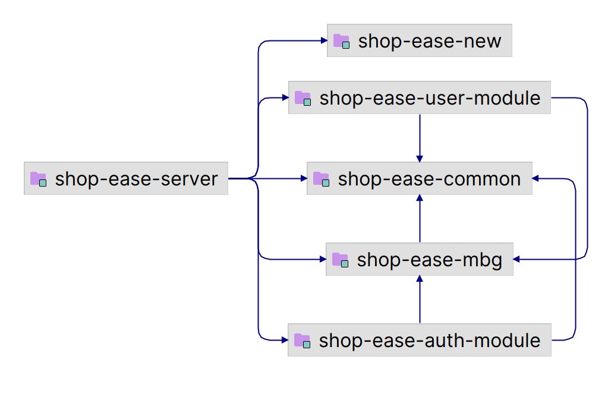

## 01 技术选型

| **技术名称**     | **版本号**        | **描述**                                                     |
| ---------------- | ----------------- | ------------------------------------------------------------ |
| **MyBatis**      | 3.0.3             | 一款流行的持久层框架，用于简化数据库操作与SQL映射。          |
| **MyBatis-Plus** | 3.5.5             | MyBatis的增强工具，提供了更多的功能和简化的CRUD操作。        |
| **wx-java-mp**   | 4.6.0             | 微信公众号开发的Java SDK，简化微信接口的集成与调用。         |
| **Knife4j**      | 4.4.0             | 基于Swagger的API文档生成工具，提供更友好的文档界面和功能。   |
| **COS API**      | 5.6.89            | 腾讯云对象存储（COS）的API版本，用于文件存储与管理。         |
| **EasyExcel**    | 4.0.3             | 阿里巴巴的高性能Excel处理工具，支持快速读写Excel文件。       |
| **Hutool**       | 5.8.16            | 一款全面的Java工具库，提供丰富的工具类以简化开发工作。       |
| **七牛SDK**      | [7.16.0, 7.16.99] | 七牛云存储的Java SDK，支持文件上传、下载及管理功能，版本范围为7.16.0到7.16.99。 |
| **Sa-Token**     | 1.39.0            | 轻量级的Java权限验证框架，提供认证、授权、单点登录等功能。   |

## 02 模块说明

```
shop-ease                   项目名
├─document                  项目文档
├─logs                      项目日志
├─shop-ease-common          通用模块
├─shop-ease-mbg             数据模型与映射关系（mybatis generated）
├─shop-ease-module          业务模块集合
│  ├─shop-ease-auth-module  认证模块
│  └─shop-ease-user-module  用户模块
├─shop-ease-new             新模块
└─shop-ease-server          服务器启动
```

## 03 模块之间依赖关系


